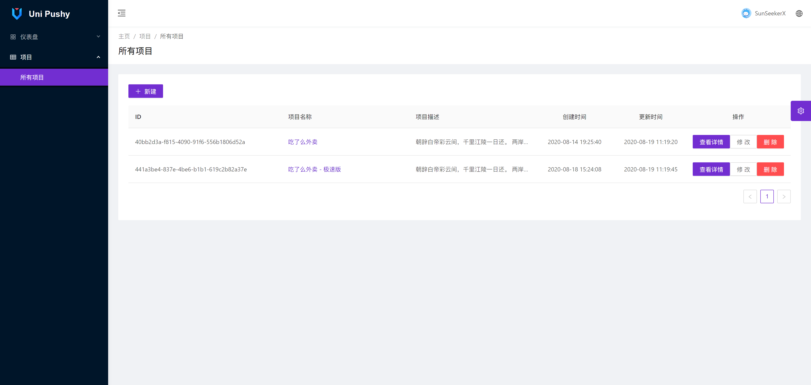
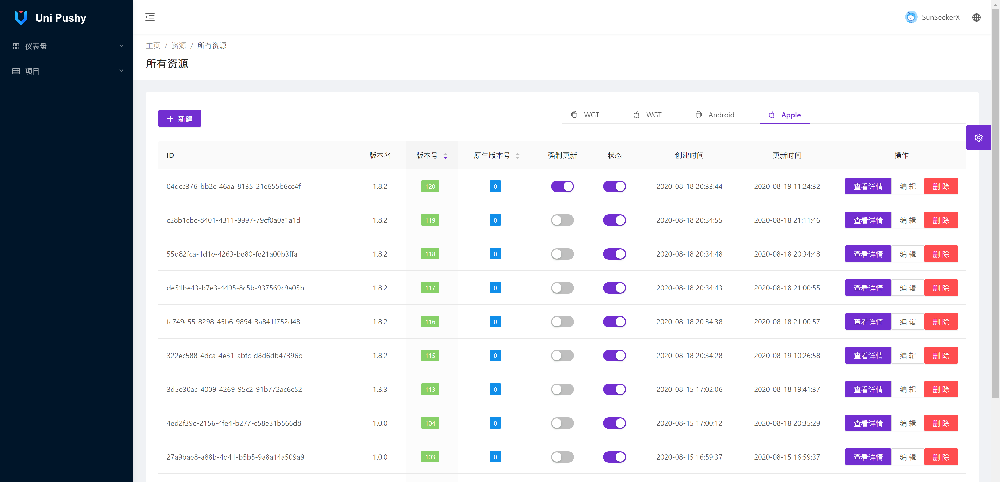

# 简介（Introduction）- uni-pushy-admin

`uni-pushy` uni-app 热更新管理平台。

这是 `uni-pushy` 的后台管理界面仓库。Github：[uni-pushy-admin](https://github.com/SunSeekerX/uni-pushy-admin)

基于 `antd-vue-pro` 的 uni-app 热更新后台控制系统

**配套后端**：[uni-pushy-server](https://github.com/SunSeekerX/uni-pushy-server)

**预览地址**：[https://uni-pushy.yoouu.cn/](https://uni-pushy.yoouu.cn/)

> 自行注册账号使用即可体验

**预览文档**：[https://api.uni-pushy.yoouu.cn/docs/](

> **uni-app App整包升级检测：** https://ask.dcloud.net.cn/article/34972
>
> **uni-app App资源热更新：** https://ask.dcloud.net.cn/article/35667

**预览图**








# ❗ 注意（Notice）

目前应用仍然处于开发阶段，不排除出现重大 `bug` 的可能性。


# 快速上手（Getting Started）

克隆仓库（Clone this repo）

```bash
git clone https://github.com/SunSeekerX/uni-pushy-admin.git
```

进入项目目录

```bash
cd uni-pushy-admin/
```

安装依赖 （Install dependencies），项目根目录下执行

```bash
npm i
# 或者
yarn
```

> 国内网络安装过慢可以安装 `tbify`， 使用说明：[tbify](https://sunseekerx.yoouu.cn/front-end/npm/#📂-tbify)

## 开发（dev）

配置环境变量（Set env），根目录下执行

```bash
mv .env.example .env.development
```

打开  `.env.development`，填写环境变量

```shell
# 运行模式
NODE_ENV=development

# 
VUE_APP_PREVIEW=true

# 请求地址前缀，不带“/”！
VUE_APP_API_BASE_URL=

# Api 加密rsa公钥
VUE_APP_API_RSA_PUBLIC_KEY=

```

**示例**

```shell
# 运行模式
NODE_ENV=development

# 
VUE_APP_PREVIEW=true

# 请求地址前缀，不带“/”！
VUE_APP_API_BASE_URL=http://192.192.192.192:3000

# Api 加密rsa公钥
VUE_APP_API_RSA_PUBLIC_KEY=-----BEGIN PUBLIC KEY-----MIGfMA0GCSqGSIb3DQEBAQUAA4GNADCBiQKBgQC75U1dRtG/6uNG2G8/89nFd7UtdKMRYhpK+2mzuxxdKqezV62TE8Y/9PfLFRd9iITqpYkDj/XOGq3BBYKR6+5oXpOY9MSke7tdQ12OmxSn4TlV3YZfXubN5nOZoWj4A9evLcZumtJPuk8kIxz9qSm8yYrOeLbIX5kdy3stl3xrNwIDAQAB-----END PUBLIC KEY-----

```


**启动**

```bash
npm run server
```


## 部署（deploy）

配置环境变量（Set env），根目录下执行

```bash
mv .env.example .env.production
```

打开  `.env.production`，填写环境变量，环境变量同开发。


**打包**

```bash
npm run build
```

打包完成生成的静态文件位于 `dist` 目录下，为标准的 `web` 项目。直接放到服务器路径下即可。

> 需要配合 `jenkins` 集成 `ci&cd` 的可以参考 [Vue项目自动化构建](https://sunseekerx.yoouu.cn/common/jenkins/#%E5%89%8D%E6%8F%90)


## uni-app 接入

查看配套后端文档快速上手 `uni-app` 章节：[uni-pushy-server](https://github.com/SunSeekerX/uni-pushy-server)


# 入门篇（Basics）

## 环境准备（Prerequisite）


## 安装（Installation）


## 设置（Configuration）

> [必备] [文件] 软件的设置


# 进阶篇（Advanced)

> [可选] [目录] 又称”开发篇“，提供中高级的开发教程


# **API**（Reference）

> [可选] [目录|文件] 软件 API 的逐一介绍


# TODO

- 系统监控
- 项目列表显示最新版本和最新wgt版本
- 应用图片logo上传
- 大文件上传
- 用户
  - 修改用户信息
  - 修改密码
  - 数据导出数据导入
- 检查更新接口缓存
  - 定时任务检查所有应用查询每个资源最大的原生版本号和最大的wgt版本号，存入redis。一但有新上传的资源就更新redis，保证大压力接口数据都来源redis减轻数据库压力。
- Dashboard
  1：统计我的应用数量
  2：统计每个应用检查更新次数
  3：统计每个应用总检查更新次数
  4：统计每个应用资源总数
  5：统计该账号下资源总数
  6：统计每个应用每个资源检索次数
  7：统计趋势
- 画出流程图


# 更新日志（Changelog）

## 0.0.1 - 2020-08-24

- 【重要】文件上传直接上传到 `OSS` ，通过后台的 `STS` 授权
- 【重要】文件上传接入阿里的 `SDK` 启用分片上传


## 0.0.1 - 2020-08-19

- 增加资源排序


## 0.0.1 - 2020-08-18

- 【重要】增加 `Api sign` 接口加密
- 优化表格显示
- 优化项目新增输入


## 0.0.1 - 2020-08-17

### Bug 修复 （Bug Fixes）

- 【重要】修复 `token` 失效退出登录重新登录页面空白的问题

### 功能（Features）

- 更好的 `token` 过期提示


## 0.0.1 - 2020-08-15

### Bug 修复 （Bug Fixes）

- 资源 `bug`：修复新增资源切换类型已经上传的文件未清除

### 功能（Features）

- 【重要】资源：增加更新日志字段


## 0.0.1 -  (2020-08-10)

### 功能（Features）

- 【重要】增加登录注册 `md5` 加密
- 【重要】项目新增 `appid` 唯一属性，原来为 `name（项目名）` 为唯一属性 
- 【重要】增加了 `wgt` 资源分类，分为`wgt-android`  和 `wgt-ios`
- 【重要】增加了 `wgt` 资源原生版本依赖
- 修改默认语言为中文
- 代码逻辑优化


# FAQ

## 这是什么？

一个uni－app 热更新的管理后台


## 有什么用？

可以用来管理 `uni-app` 热更新的资源和版本。


## 什么是热更新？

装在手机上的 app，不让用户知道就可以增加删除某些功能。快速修复 bug，快速更新功能。


## 有哪些技术用到了热更新？

`React native` ，`flutter `，`uni-app`


## 为什么要做这个？

网上又没有，不只能自己做。


## 后端用的是什么语言框架？

`Nestjs`


## 为什么用Nestjs ？

其他的我也不会。


## 为什么要用 antd-vue？

至少它一直在更新，你来维护 `element-ui` 吗？


## 为什么有个数据字典模块？

想做一套完整的后台解决方案。


## TS怎么样？

有一次写 `vue` 尝试了下 `ts`，感觉像 "si" 一样。写 `ts` 还要多些那么多代码，为什么还要确定数据类型，有什么 `interface` ，`type`。

 无意中看到了 `nestjs `，写多了 `ts ` 感觉 `js` 像 "si" 一样。


## Nestjs 好用吗？

`Node` 后端要是火起来，`nestjs` 应该是碾压 `express`，`koa2`，`egg.js`。。。


## 为什么要用你写的？

你不想看看我是怎么实现的吗？


## 会持续更新吗？

不会


## 确实学到了一些东西怎么感谢你？

啊这~，你给我点一个 ⭐ 嘛～


## 有问题可以问你吗？

你要是知道你的问题是什么，可以来问我。


## 怎么联系你。

能找到这个项目找不到我的联系方式？

